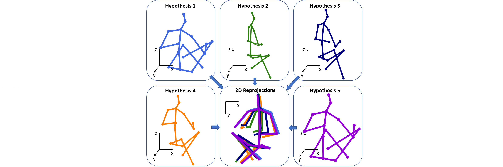
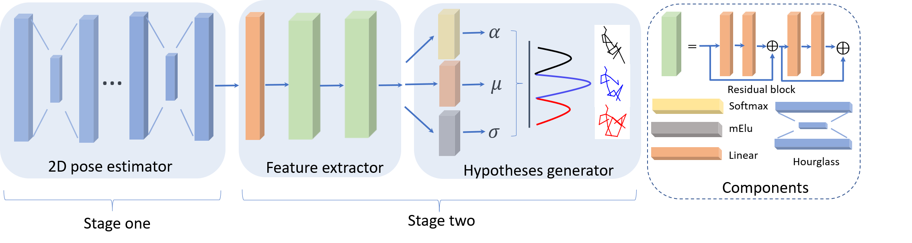

# 3D Human Pose Estimation using Mixture Density Networks

**About**
This repository contains the implementation of the paper *"Generating Multiple Hypotheses for 3D Human Pose Estimation with Mixture Density Network"*. This project includes training, testing, and analysis scripts, along with all necessary dependencies and a description of the dataset used.

It is argued that 3D human pose estimation from a monocular/2D-joint input is an inverse problem where multiple solutions can exist.


Two-stage approach is used to generate multiple 3D pose hypotheses. The 2D joints are firstly detected from the input images in the first stage, followed by a feature extractor and hypotheses generator to generate 3D pose hypotheses.



Link to the paper on [arXiv](https://arxiv.org/pdf/1904.05547.pdf).

## Table of Contents
- [Project Structure](#project-structure)
- [Requirements](#requirements)
- [Setup and Installation](#setup-and-installation)
- [Dataset](#dataset)
- [Training the Model](#training-the-model)
- [Testing the Model](#testing-the-model)

## Project Structure

```plaintext
.
├── data/                 # Directory containing the dataset (.npz files)
├── src/                  # Source codes for training, testing, and analysis
├── requirements.txt      # List of dependencies
├── README.md             # This readme file
├── report.pdf            # PDF containing implementation details and results


**Dependencies**
1. h5py--to read data
2. Tensorflow 1.8

**Train**

Get this code:
```
git clone https://github.com/chaneyddtt/Generating-Multiple-Hypotheses-for-3D-Human-Pose-Estimation-with-Mixture-Density-Network.git 
```
Download the 2D detections of [Human3.6 dataset](https://github.com/una-dinosauria/3d-pose-baseline).

Run:
```
python predict_3dpose_mdm.py --train_dir <specify your training folder>
```
To train with one or two missing joint(s) randomly selected from the limbs by run:
```
python predict_3dpose_mdm.py --miss_num <specify how many joints are missing>
```
You can also change other arguments in the predict_3dpose_mdm.py in a similar way.

 **Test**

Down the pretrained model (https://drive.google.com/open?id=1ndJyuVL-7fbhw-G654m5U8tHogcQIftT)
 
To test a pretrained model, run:
```
python predict_3dpose_mdm.py --test True --load 4338038 --load_dir ../path/to/model/ (model with the dirichlet conjucate prior)
```
or run:
```
python predict_3dpose_mdm.py --test True --load 4679232 --load_dir ../path/to/model/ (model without the dirichlet conjucate prior)
```
**Visualize**

To visualze all the five 3D pose hypotheses generated, run:
```
python predict_3dpose_mdm.py --sample True --load 4338038 --load_dir ../path/to/model/ 
```


